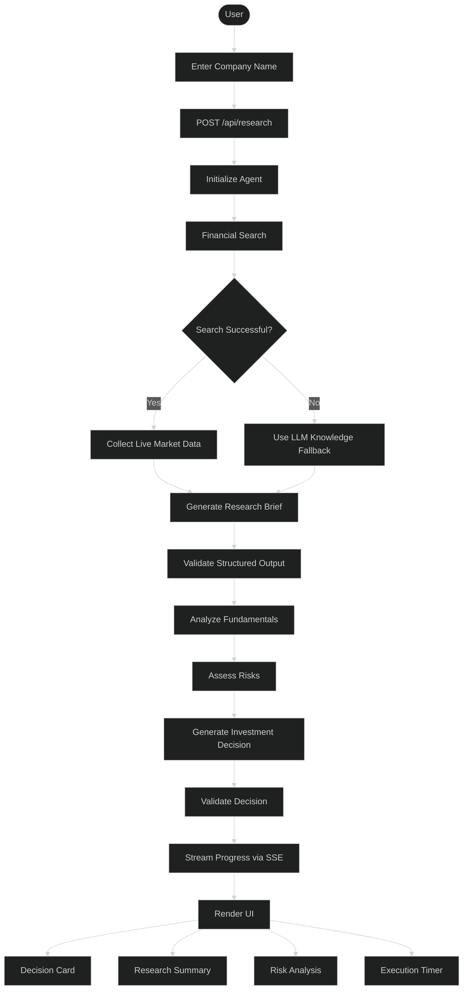

# AI Investment Research Agent

> Institutional-style equity research in one click. Enter a company name and receive a structured **INVEST** or **PASS** recommendation powered by a multi-stage AI agent.


## Live Demo

- **Demo:** https://investment-ai-agent-vert.vercel.app/
- **GitHub:** https://github.com/ylcharan/investment-ai-agent

---

# Overview

The AI Investment Research Agent performs institutional-style equity research using a multi-stage reasoning pipeline instead of a single LLM prompt.

Given a company name, the application:

- Collects live financial information
- Generates a structured research report
- Analyzes business fundamentals
- Assesses investment risks
- Produces a final INVEST/PASS recommendation
- Streams progress live to the frontend

---

# Features

- Multi-stage AI workflow
- LangGraph orchestration
- Structured outputs using Zod
- Live web search (Tavily)
- Gemini LLM integration
- Server-Sent Events (SSE)
- Risk analysis
- Fundamentals analysis
- Investment recommendation
- Modern Next.js UI
- Graceful fallback when search fails

---

# Flow



---

# Tech Stack

| Layer | Technology |
|-------|------------|
| Framework | Next.js 16 |
| UI | React 19 + Tailwind CSS v4 |
| AI | LangChain.js + LangGraph.js |
| LLM | Google Gemini |
| Search | Tavily |
| Validation | Zod |
| Streaming | SSE |

---

# Folder Structure

```text
app/
components/
lib/
docs/
```

---

# Installation

```bash
git clone https://github.com/ylcharan/investment-ai-agent.git

cd investment-ai-agent

npm install

cp .env.example .env.local

npm run dev
```

---

# Environment Variables

```env
GEMINI_API_KEY=
GEMINI_MODEL=gemini-3.5-flash
TAVILY_API_KEY=
```

---

# How It Works

1. User submits company.
2. Search gathers financial information.
3. Research brief is generated.
4. Structured validation.
5. Fundamentals analysis.
6. Risk analysis.
7. Investment decision.
8. Results streamed live.
9. UI renders structured output.

---

# Future Improvements

- Peer comparison
- Historical price charts
- PDF export
- Portfolio analysis
- Authentication
- Saved reports

---

# Troubleshooting

| Problem | Solution |
|----------|----------|
| Missing API key | Configure `.env.local` |
| Gemini 429 | Retry or use flash-lite |
| Missing Tavily | Agent falls back to LLM |

Built for the InsideIIM × Altuni AI Labs AI Product Development Engineer Take-Home Assignment.
