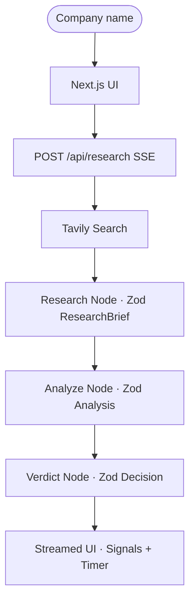

# AI Investment Research Agent

**Live demo:** [investment-ai-agent-vert.vercel.app](https://investment-ai-agent-vert.vercel.app/)  
**Source:** [github.com/ylcharan/investment-ai-agent](https://github.com/ylcharan/investment-ai-agent)

> Institutional-style equity research in one click — enter a company, watch a LangGraph agent gather evidence, score fundamentals & risks, and stream a structured **INVEST** or **PASS** verdict with green/red signal highlighting.

Built for **InsideIIM × Altuni AI Labs** (AI Product Development Engineer take-home). Stack matches the required production stack: **Next.js · LangChain.js / LangGraph.js · Gemini**.

---

## Overview

Given a company name (e.g. `Apple`, `Tesla`, `Reliance`, `TCS`), the agent:

1. Fetches live market / news context via **Tavily**
2. Produces a **Zod-structured research brief** (financials with positive / neutral / negative signals)
3. Runs **fundamentals + risk analysis** as structured JSON
4. Issues a **CIO verdict** — `INVEST` | `PASS` with confidence, bull/bear cases, key metrics, risk level, and reasoning
5. Streams every stage to the UI over **SSE**, including total generation time

This is not a single mega-prompt chatbot. It is a **multi-stage research pipeline** with typed outputs, failure handling, and an audit trail you can expand stage-by-stage.

### What sets it apart

| Differentiator | Why it matters |
|----------------|----------------|
| **LangGraph pipeline** | Research → Analyze → Verdict — each node has one job, like a small equity desk |
| **Zod end-to-end** | Research, analysis, and decision are all schema-validated — no free-form waffle |
| **Signal-colored UI** | Positive → green · Negative → red · Risk severity → green / amber / red |
| **Live SSE streaming** | Status updates (`Searching…`, `Writing brief…`, `Forming verdict…`) instead of a dead spinner |
| **Resilient Gemini stack** | Model fallback, 429 retries, timeouts — hardened against real free-tier limits |
| **Graceful search degrade** | Without Tavily, continues on LLM knowledge and flags **data gaps** |
| **Generation timer** | Shows how long the full run took (e.g. `24.3s`) |
| **Editorial dark UI** | Decision-first layout — not a tile-heavy “AI chatbot” dashboard |

---

## Features

- **Multi-stage agent pipeline** — research brief → fundamentals & risks → CIO decision
- **Structured outputs (Zod)** — metrics, ratings, severity, bull/bear cases always present
- **Live web research** — Tavily finance-topic search with timeout + fallback
- **Streaming progress** — Server-Sent Events from `/api/research`
- **Color-coded signals** — green / red highlighting on metrics, cases, and risk severity
- **Expandable audit panel** — inspect Research / Fundamentals / Risks after the verdict
- **Production deploy** — live on [Vercel](https://investment-ai-agent-vert.vercel.app/)

---

## Architecture



### Pipeline stages

| Stage | Role |
|-------|------|
| **Research** | Search the web → structured brief (overview, financials + signals, competitive position, developments, valuation, data gaps) |
| **Analyze** | Fundamentals (quality score, Strong/Adequate/Weak, highlights) + Risks (overall level, categories with severity, top risks) |
| **Verdict** | Structured `INVEST` / `PASS` with confidence, bull/bear, key metrics, reasoning, risk, time horizon |

Originally four LLM hops were used; fundamentals + risks were **collapsed into one analyze call** to cut quota usage and avoid long “stuck” retries on free-tier Gemini — without losing the audit surface in the UI.

---

## Tech Stack

| Layer | Choice |
|-------|--------|
| Framework | **Next.js 16** (App Router) |
| UI | **React 19**, **Tailwind CSS v4** |
| Agent | **LangGraph.js**, **LangChain.js** |
| LLM | **Google Gemini** (`@langchain/google-genai`) — default `gemini-3.5-flash` |
| Search | **Tavily** (`@langchain/tavily`) |
| Validation | **Zod** (research, analysis, decision schemas) |
| Streaming | **SSE** from `app/api/research/route.ts` |

---

## Folder Structure

```
app/
  page.tsx                 # Main research UI
  api/research/route.ts    # SSE + JSON research API
  layout.tsx · globals.css
components/
  company-form.tsx         # Input + quick suggestions
  research-progress.tsx    # Live stage progress
  decision-card.tsx        # Verdict · signals · timer
  analysis-panel.tsx       # Expandable research / fundamentals / risks
lib/
  types.ts                 # Zod schemas + AgentState
  ui/signals.ts            # Green / red / amber signal helpers
  agent/
    graph.ts               # Pipeline + streamResearch()
    prompts.ts             # Stage prompts
    tools.ts               # Tavily search + timeout
    retry.ts               # Timeout, retry, model fallback
docs/
  example-runs.md          # Sample company outputs
  llm-transcripts/         # Build chat logs (bonus)
```

---

## Installation & Local Development

### Prerequisites

- Node.js **18+**
- [Gemini API key](https://aistudio.google.com/apikey) (**required**)
- [Tavily API key](https://tavily.com) (optional, strongly recommended)

### Setup

```bash
git clone https://github.com/ylcharan/investment-ai-agent.git
cd investment-ai-agent

npm install
cp .env.example .env.local
```

Edit `.env.local`:

```bash
GEMINI_API_KEY=your-gemini-api-key
GEMINI_MODEL=gemini-3.5-flash          # optional
TAVILY_API_KEY=tvly-your-tavily-key    # optional but recommended
```

```bash
npm run dev
```

Open [http://localhost:3000](http://localhost:3000) → enter a company → **Analyze**.

### Production

```bash
npm run build
npm start
```

### Environment variables

| Variable | Required | Description |
|----------|----------|-------------|
| `GEMINI_API_KEY` | **Yes** | Google Gemini API key |
| `GEMINI_MODEL` | No | Default `gemini-3.5-flash`; falls back to `gemini-3.1-flash-lite` |
| `TAVILY_API_KEY` | No | Live finance web search |

---

## How It Works

1. **Search** — One finance-topic Tavily query (15s timeout). On failure, continue with model knowledge and mark data gaps.
2. **Research brief (Zod)** — Overview, financial metrics with `positive | neutral | negative`, competitive position, news, valuation.
3. **Analysis (Zod)** — Quality score (1–10), Strong/Adequate/Weak, highlights with signals; risk overall + severity-tagged categories + top risks.
4. **Verdict (Zod)** — Forced `INVEST` / `PASS` with confidence, cases, metrics, reasoning.
5. **Stream** — Each step yields SSE events; UI updates progress, structured panels, and elapsed time.

Non-listed / insufficient-data companies are instructed to **PASS** with clear reasoning (advisory research only — not financial advice).

---

## Key Decisions & Trade-offs

### Chose

- **LangGraph over one prompt** — clearer reasoning, better debugging, streamable stages  
- **Zod for every stage** — consistent UI; green/red signals are data-driven, not CSS guesses  
- **Gemini** — assignment-friendly access; then hardened for 429 / model deprecations  
- **Collapse analyze** — fewer LLM calls → fewer free-tier hangs  
- **SSE + status messages** — trust and demo polish  
- **Advise, don’t execute** — no brokerage APIs  

### Left out (on purpose)

| Deferred | Why |
|----------|-----|
| TradingView / price charts | Scope = fundamental research + decision |
| Parallel multi-agent swarm | Quota & latency cost on free tier |
| Auth / saved history | Single-session keeps the demo focused |
| PDF export | Nice-to-have after the core loop |
| Peer comparison in one run | High value; more tokens & latency |

---

## Example Runs

See **[docs/example-runs.md](./docs/example-runs.md)** for narrative samples.

| Company | Typical call | Notes |
|---------|--------------|-------|
| Apple | INVEST (high confidence) | Ecosystem moat, services, cash; premium valuation |
| Tesla | PASS / cautious | Growth vs margins, competition, narrative valuation |
| Reliance | INVEST (medium) | India digital/retail + energy; conglomerate complexity |

Try live: [investment-ai-agent-vert.vercel.app](https://investment-ai-agent-vert.vercel.app/) — suggestions include Apple · Tesla · NVIDIA · Reliance · Infosys.

---

## Deployment

Deployed on **Vercel**:

**→ [https://investment-ai-agent-vert.vercel.app/](https://investment-ai-agent-vert.vercel.app/)**

To redeploy:

1. Push to [github.com/ylcharan/investment-ai-agent](https://github.com/ylcharan/investment-ai-agent)
2. Import the repo in Vercel
3. Set `GEMINI_API_KEY` (+ optional `TAVILY_API_KEY`, `GEMINI_MODEL`)
4. Deploy

---

## What I Would Improve With More Time

- [ ] Structured market-data feed (Yahoo Finance / Alpha Vantage) for numeric fundamentals  
- [ ] Peer comparison in the same graph run  
- [ ] Eval harness (golden companies + expected verdict ranges)  
- [ ] Human-in-the-loop follow-up before locking the verdict  
- [ ] Session cache for repeated company lookups  
- [ ] PDF / Markdown report export  
- [ ] Per-node model routing (long-context research vs flash verdict)

---

## Known Limitations

- **Free-tier Gemini limits** — parallel or rapid runs can hit `429`; the app retries / falls back / times out with clear errors  
- **Model availability** — older IDs (`gemini-2.0-flash`, `gemini-2.5-flash`) may be unavailable to new keys; defaults target Gemini 3.x  
- **Private / obscure companies** — limited public data; agent should PASS and list data gaps  
- **Advisory only** — not investment advice; humans decide  

---

## Troubleshooting

| Issue | Fix |
|-------|-----|
| `GEMINI_API_KEY is not configured` | Add key to `.env.local` (or Vercel env) and restart |
| `429` / rate limit | Wait 1–2 min, or set `GEMINI_MODEL=gemini-3.1-flash-lite` |
| Model `404` / unavailable | Use `gemini-3.5-flash` or `gemini-3.1-flash-lite` |
| Stuck / slow research | Ensure Tavily key is set; check network; timeouts should fail loudly within ~60s per LLM call |
| Empty search | Agent continues without Tavily and shows data gaps |

---

## BONUS — LLM build transcripts

Built with **Cursor + AI pair programming** (architecture, Gemini migration, LangGraph node naming, quota/stuck fixes, Zod UI, deploy).

Process notes for reviewers: **[docs/llm-transcripts/](./docs/llm-transcripts/)**

---

## Links

| | |
|--|--|
| **Live app** | [investment-ai-agent-vert.vercel.app](https://investment-ai-agent-vert.vercel.app/) |
| **GitHub** | [ylcharan/investment-ai-agent](https://github.com/ylcharan/investment-ai-agent) |
| **Example runs** | [docs/example-runs.md](./docs/example-runs.md) |

---

## License

Built for the **InsideIIM × Altuni AI Labs** take-home assignment.

### Acknowledgements

- [LangGraph.js](https://langchain-ai.github.io/langgraphjs/)
- [LangChain.js](https://js.langchain.com/)
- [Google Gemini](https://ai.google.dev/)
- [Tavily](https://tavily.com/)
- [Next.js](https://nextjs.org/)
