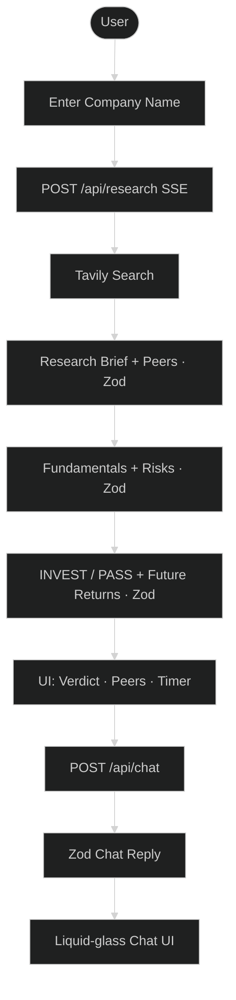

# AI Investment Research Agent

> Institutional-style equity research in one click. Enter a company name and receive a structured **INVEST** or **PASS** recommendation — plus peers, future-return scenarios, and a follow-up research chat.


## Live Demo

- **Demo:** [https://investment-ai-agent-vert.vercel.app/](https://investment-ai-agent-vert.vercel.app/)
- **GitHub:** [https://github.com/ylcharan/investment-ai-agent](https://github.com/ylcharan/investment-ai-agent)

---

## Overview

The AI Investment Research Agent performs equity research using a **multi-stage LangGraph pipeline** instead of a single LLM prompt.

Given a company name, it:

1. Collects live financial / news context (Tavily)
2. Generates a **Zod-structured research brief** (with sector + peer companies)
3. Analyzes **fundamentals & risks** as structured JSON
4. Issues an **INVEST / PASS** verdict with confidence, bull/bear cases, metrics, and **future return scenarios**
5. Streams progress live over **SSE**
6. Opens a **follow-up chat** grounded in that research (also Zod-validated)

---

## Highlighted Features

### Recently shipped

| Feature | What it does |
|---------|----------------|
| **Research chat** | Ask follow-ups about the verdict, risks, returns, or peers — answers are grounded in the completed analysis |
| **Zod-validated chat replies** | Every chat answer includes `tone`, `keyPoints`, `citations`, `confidence`, `followUps`, and optional `caveats` |
| **Liquid-glass chat UI** | Frosted glass bubbles for assistant / user messages |
| **Same-category peers (top 5)** | Right-side suggestions of related companies in the same sector — click to research |
| **Future returns** | 1Y / 3Y / 5Y expected return scenarios with conviction, upside & downside cases |
| **Signal-colored UI** | Green / amber / red highlighting for positive, neutral, and negative signals |
| **Compact top search** | While analyzing, the search bar shrinks into a sticky top bar |
| **Generation timer** | Shows how long the full research run took |

### Core platform

- **Multi-stage LangGraph workflow** — Research → Analyze → Verdict
- **Zod end-to-end** — research brief, analysis, decision, and chat all schema-validated
- **Live web search** via Tavily (with graceful LLM fallback + data-gap flags)
- **Google Gemini** with model fallback + retry / timeout handling
- **SSE streaming** progress (`Searching…`, `Writing brief…`, `Forming verdict…`)
- **Expandable audit trail** — Research / Fundamentals / Risks panels
- **Editorial dark UI** — decision-first layout, not a chatbot dump

---

## Flow



---

## Tech Stack

| Layer | Technology |
|-------|------------|
| Framework | Next.js 16 (App Router) |
| UI | React 19 + Tailwind CSS v4 |
| AI | LangChain.js + LangGraph.js |
| LLM | Google Gemini (`gemini-3.5-flash` → fallback `gemini-3.1-flash-lite`) |
| Search | Tavily |
| Validation | Zod (research, analysis, decision, chat) |
| Streaming | Server-Sent Events (SSE) |

---

## Folder Structure

```text
app/
  page.tsx                 # Research UI + compact search + results layout
  api/research/route.ts    # Multi-stage research SSE API
  api/chat/route.ts        # Follow-up chat API (Zod-validated)
components/
  company-form.tsx
  research-progress.tsx
  decision-card.tsx        # Verdict · metrics · future returns
  analysis-panel.tsx       # Expandable research / fundamentals / risks
  related-companies.tsx    # Top 5 same-category peers
  research-chat.tsx        # Liquid-glass chat with structured replies
lib/
  types.ts                 # All Zod schemas
  ui/signals.ts            # Green / red / amber helpers
  agent/
    graph.ts               # LangGraph pipeline + streaming
    prompts.ts
    tools.ts               # Tavily search
    retry.ts               # Timeout · retry · model fallback
    chat.ts                # Context-aware chat + ChatReplySchema
docs/
  example-runs.md
  llm-transcripts/
```

---

## Installation

```bash
git clone https://github.com/ylcharan/investment-ai-agent.git
cd investment-ai-agent

npm install
cp .env.example .env.local
# add GEMINI_API_KEY (+ optional TAVILY_API_KEY)

npm run dev
```

Open [http://localhost:3000](http://localhost:3000).

---

## Environment Variables

```env
GEMINI_API_KEY=your-gemini-api-key          # required
GEMINI_MODEL=gemini-3.5-flash               # optional
TAVILY_API_KEY=tvly-your-tavily-api-key     # optional, recommended
```

---

## How It Works

1. User submits a company name
2. Tavily gathers market / news context (or falls back to model knowledge)
3. **Research node** returns a Zod brief: overview, sector, financials + signals, **5 peer companies**
4. **Analyze node** returns structured fundamentals + risks
5. **Verdict node** returns INVEST/PASS, metrics, reasoning, and **future returns (1Y / 3Y / 5Y)**
6. UI streams each stage, then shows verdict, peers sidebar, and generation time
7. **Chat** lets you ask follow-ups; replies are Zod-validated (`tone`, key points, citations, confidence)

---

## Example Experience

| Step | You see |
|------|---------|
| Search `Apple` | Live progress through research → analyze → verdict |
| Verdict | INVEST/PASS banner, confidence, risk, future returns |
| Right sidebar | Top 5 peers in the same category (click to analyze) |
| Chat | Ask “Why this verdict?” → structured liquid-glass reply |

More narrative samples: [docs/example-runs.md](./docs/example-runs.md)

---

## What I Would Improve With More Time

### Priority next (planned)

- **Interactive graphs** — historical price / valuation charts for the researched company (e.g. Yahoo Finance or similar market-data feed)
- **Side-by-side peer comparison** — compare the target company against peers in the **same sector/field** on fundamentals, risk, and return outlook in one view

### Also on the roadmap

- [ ] Numeric fundamentals from a structured market-data API (less reliance on search snippets)
- [ ] Eval harness (golden companies + expected verdict ranges)
- [ ] Human-in-the-loop before locking a verdict
- [ ] Session cache for repeated lookups
- [ ] PDF / Markdown research report export
- [ ] Auth + saved research history
- [ ] Portfolio-level analysis across multiple holdings

---

## Known Limitations

- Free-tier Gemini may return `429` under heavy use — the app retries / falls back / times out with clear errors
- Peer suggestions and future returns are model estimates, not guarantees
- Private / obscure companies may lack data → agent should PASS and flag gaps
- Advisory research only — not personalized financial advice

---

## Troubleshooting

| Problem | Solution |
|---------|----------|
| Missing API key | Set `GEMINI_API_KEY` in `.env.local` (or Vercel env) |
| Gemini `429` | Wait, or set `GEMINI_MODEL=gemini-3.1-flash-lite` |
| Model `404` | Use `gemini-3.5-flash` / `gemini-3.1-flash-lite` |
| No live search | Add `TAVILY_API_KEY`; agent still runs with data-gap notes |
| Chat errors | Ensure research finished first; chat needs the analysis context |

---

## BONUS — LLM build transcripts

Built with Cursor + AI pair programming. Process notes: [docs/llm-transcripts/](./docs/llm-transcripts/)

---

## Links

| | |
|--|--|
| **Live app** | [investment-ai-agent-vert.vercel.app](https://investment-ai-agent-vert.vercel.app/) |
| **Source** | [ylcharan/investment-ai-agent](https://github.com/ylcharan/investment-ai-agent) |

---

Built for the **InsideIIM × Altuni AI Labs** AI Product Development Engineer take-home assignment.
